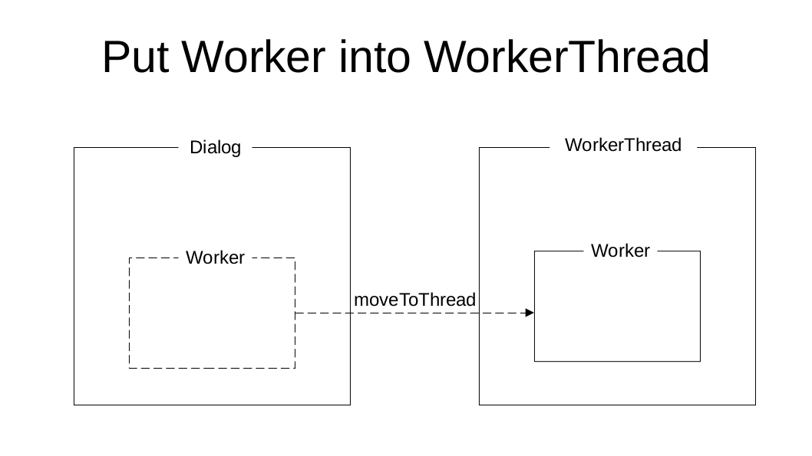
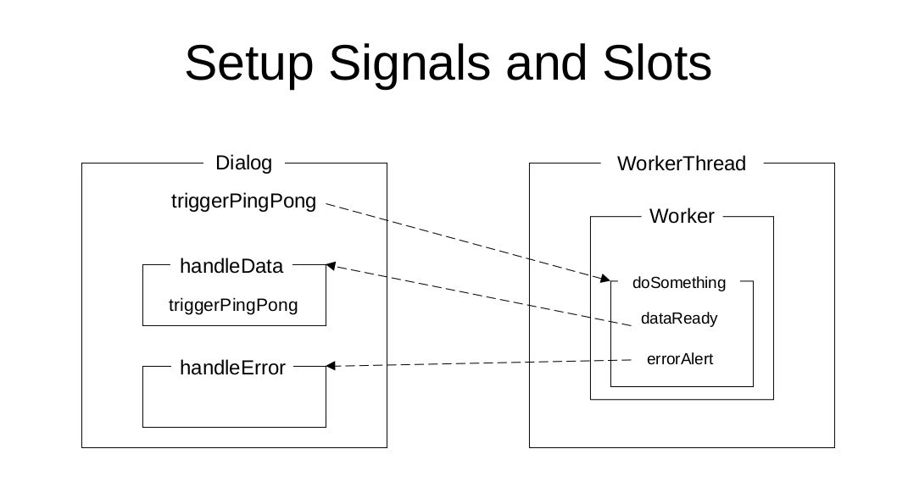
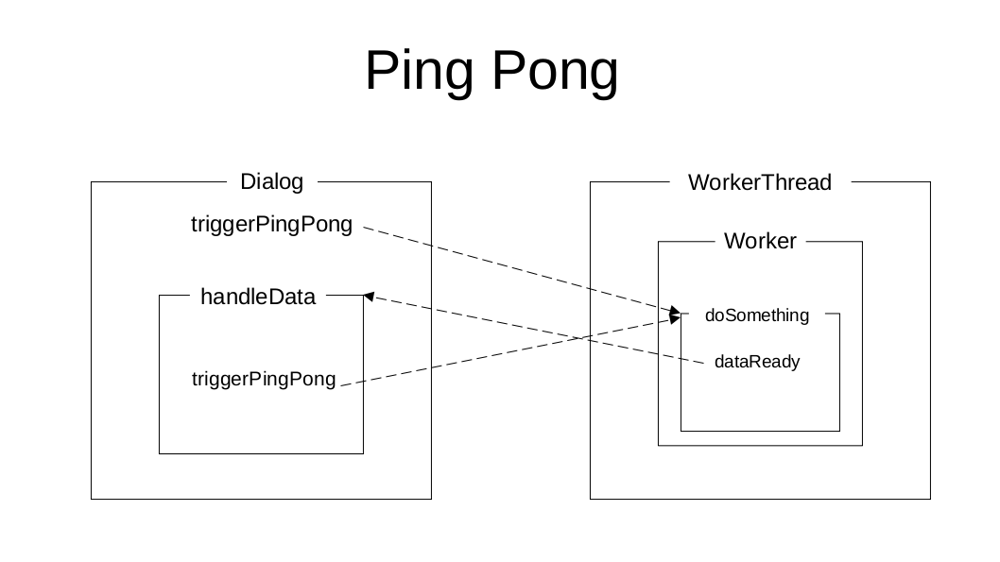

# QtThreadTemplate in way of Ping-Pong operation
This is a QThread example in the way of ping-pong interaction.
There are three steps to do threading.
1. create a object from Worker, and move into QThread.
2. set up corresponding signals, and slots.
3. establish ping-pong operation between Dialog, and WorkerThread.

# Object from Worker and to WorkerThread

'''
Dialog::Dialog(QWidget *parent)
    : QDialog(parent)
    , ui(new Ui::Dialog)
{
    ...
    this->threadWorker = new Worker();
    this->threadWorker->moveToThread(&this->workerThread);
'''

# Layout of signals and slots

'''
Dialog::Dialog(QWidget *parent)
    : QDialog(parent)
    , ui(new Ui::Dialog)
{
    ...
    connect(&workerThread, &QThread::finished, this->threadWorker, &QObject::deleteLater);
    connect(this, &Dialog::triggerPingPong, this->threadWorker, &Worker::doSomething);
    connect(this->threadWorker, &Worker::dataReady, this, &Dialog::handleData);
    connect(this->threadWorker, &Worker::errorAlert, this, &Dialog::handleError);
'''

# Ping-Pong Operation

'''
Dialog::Dialog(QWidget *parent)
    : QDialog(parent)
    , ui(new Ui::Dialog)
{
    ...
    this->workerThread.start();
    this->dpsTimer.start();
    this->setPingPong(true);

    emit triggerPingPong(0);
}

'''

'''
void Worker::doSomething(const int typeOfSource)
{
    //qDebug() << typeOfSource;
    // get the data from streamer
    switch (typeOfSource) {
    case 0: // from serial
        break;
    case 1: // from IP Cam
        break;
    case 2: // from tcp
        break;
    }

    emit dataReady(this->buffer, 100, typeOfSource);
}
'''

'''
void Dialog::handleData(const void *buffer, int len, int from)
{
    // TODO: Process data
    ++this->dpsCount;
    int elapsed_tme = this->dpsTimer.elapsed();
    if (elapsed_tme > 1000 and this->dpsCount > 0) {
        //std::cout << frames << " during " << elapsedTime << std::endl;
        double dps = (double)this->dpsCount * 1000.0 / (double)(elapsed_tme);
        this->setWindowTitle(QString(tr("QtThreadTemplate - %1 [Data Per Sec]")).arg(dps, 3, 'f', 0, ' '));
        this->dpsCount = 0;
        this->dpsTimer.restart();
    }

    if (this->isPingPong) {
        emit triggerPingPong(from);
    }
}
'''
